**INTEGRANTES**  
Daniel Alejandro Diaz Camelo.  
Vicente Garzon Rios.  

**INVESTIGACION**
1. El parametro "package" es una fase, es decir un paso en el ciclo de vida del desarrollo. Tiene como objetivo tomar el codigo compilado y lo empaqueta en un formato distribuible, como JAR. Otros parametros que se pueden enviar al comando mvn son: validate, compile, test, integration-test, verify, install, deploy, clean, site.  
2. Para ejecutar un proyecto Maven desde linea de comando se usa el siguiente comando: mvn exec:java -Dexec.mainClass="\<ruta de la clase principal>". Para enviar parametros, se  agrega -Dexec.args="\<argumento>". Si el argumento contiene espacios, es necesario encerrarlo entre comillas simples (''), de lo contrario, se interpretará como varios parámetros separados por espacios.

**PASOS**
1. Verificamos la version de Maven
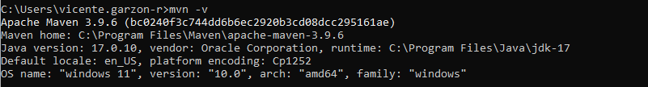
2. Creamos el entorno  

3. Creamos el proyecto en Maven
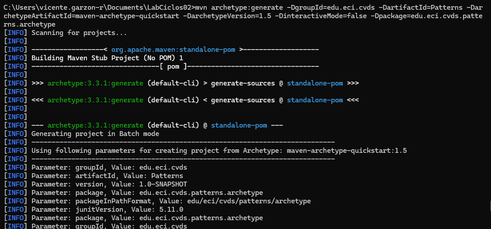
4. Verificamos el conjunto de archvios y directorios del proyecto creado
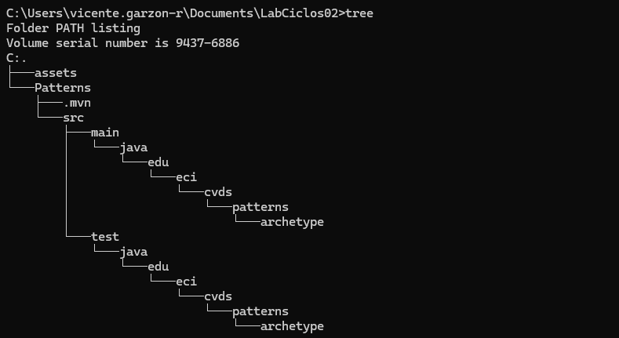
5. Modificamos las propiedades del archvio Pom
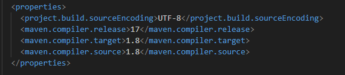
6. Compilamos el proyecto Maven 
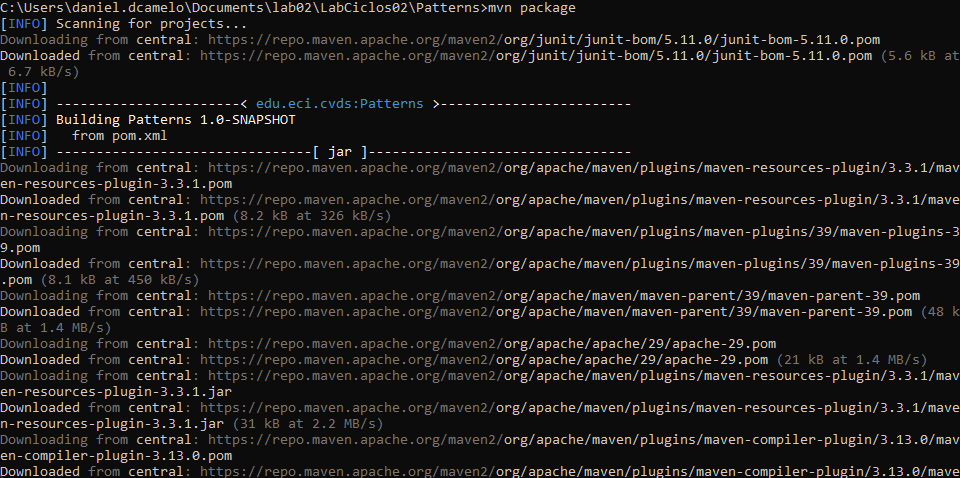  
7. Añadimos el plugin para el ejecutable en pom 
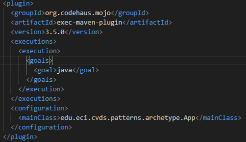  
8. Ejecutamos la clase App.java, la cual usamos como parametro en "mainClass"
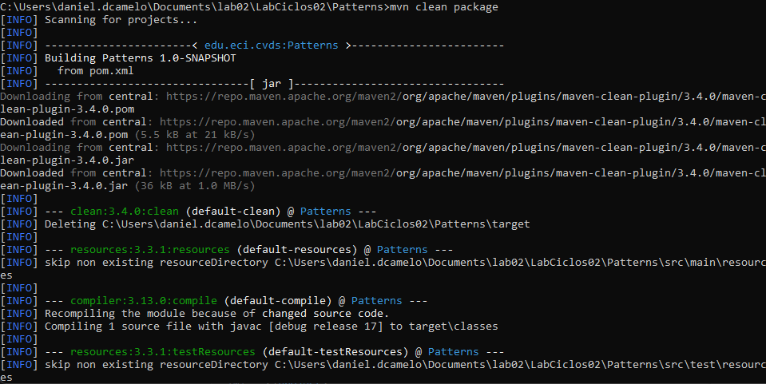  
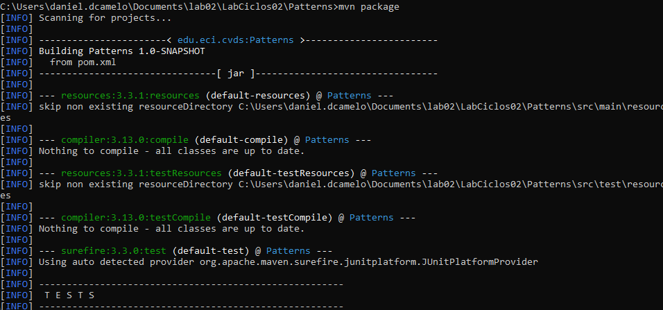  
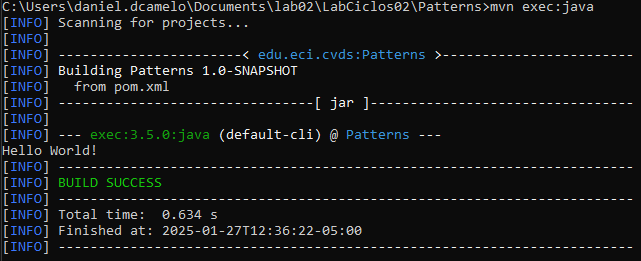 
9. Realizamos el metodo personalizado  
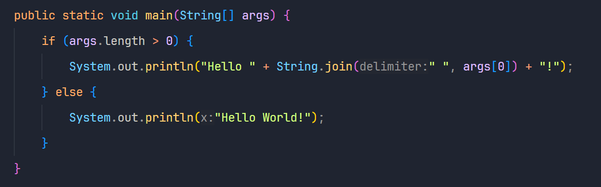  
10. Ejecutamos nuevamente la clase sin parametros  
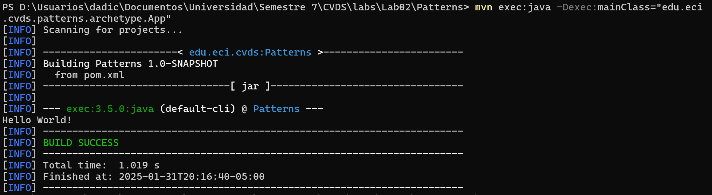  
11. Ejecutamos la clase con el nombre como parametro  
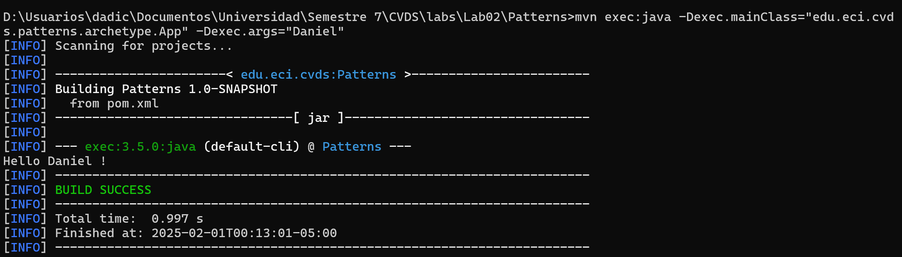  
12. Ejecutamos la clase con el nombre y apellido como parametro, el cual solo imprime el nombre ya que toma nomas el primer argumento (Lee el nombre y apellido como dos parametros)
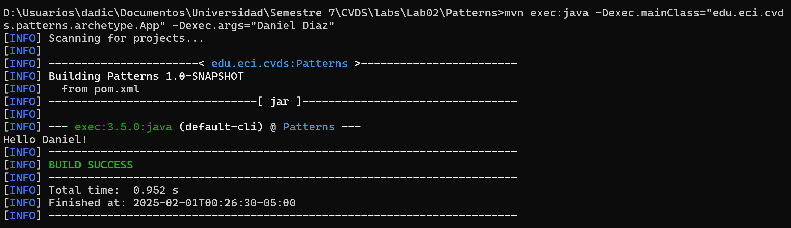  
13. Ejecutamos la clase  con el nombre y apellido usando parametro compuesto para que imprima todo (Lee el nombre y apellido como un solo argumento)  
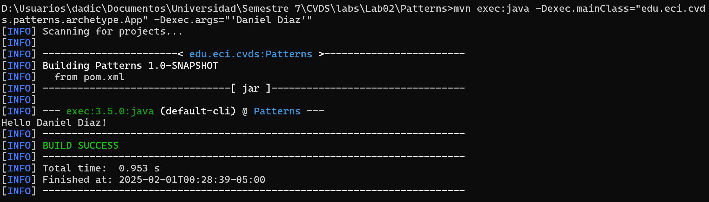  
14. Creamos el paquete edu.eci.cvds.patterns.shapes y el paquete edu.eci.cvds.patterns.shapes.concrete  
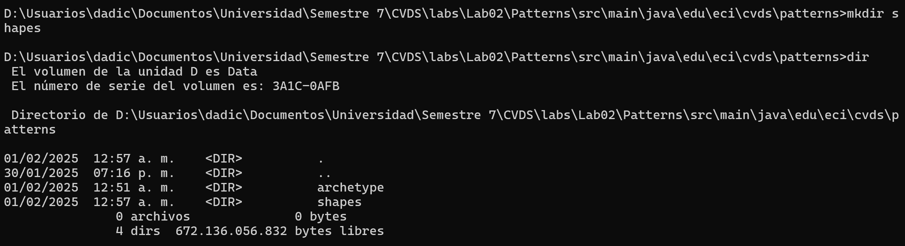  
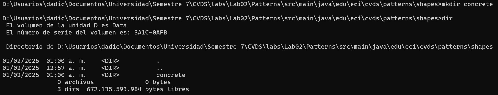  
15. Creamos la interfaz Shape  
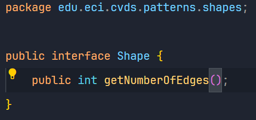  
16. Creamos la enumeracion RegularShapeType  
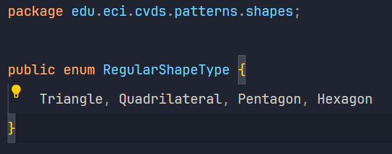  
