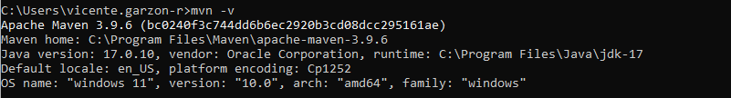
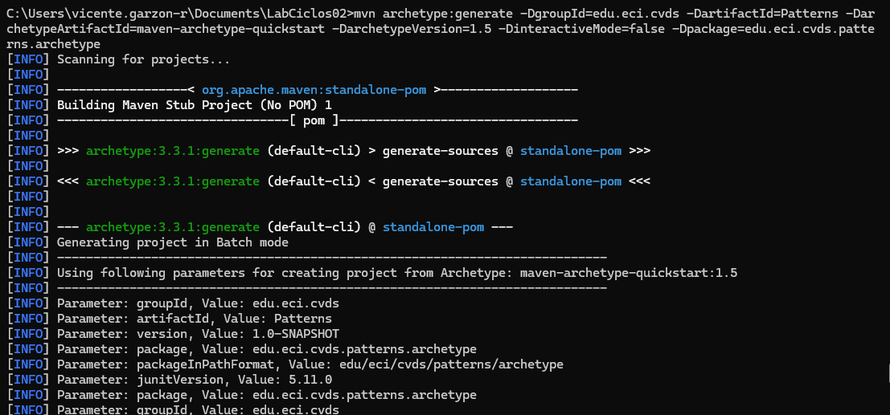
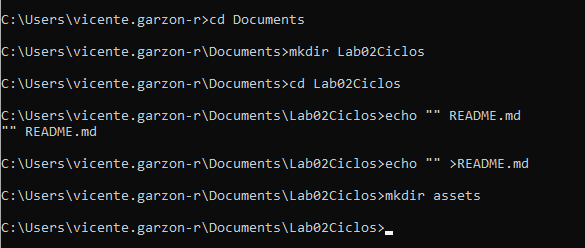

**INTEGRANTES**  
Daniel Alejandro Diaz Camelo.  
Vicente Garzon Rios.  

**INVESTIGACION**
1. El parametro "package" es una fase, es decir un paso en el ciclo de vida del desarrollo. Tiene como objetivo tomar el codigo compilado y lo empaqueta en un formato distribuible, como JAR. Otros parametros que se pueden enviar al comando mvn son: validate, compile, test, integration-test, verify, install, deploy, clean, site.

**PASOS**
1. Verificamos la version de Maven

2. Creamos el proyecto en Maven

3. Verificamos el conjunto de archvios y directorios del proyecto creado

4. Creamos el entorno

5. Modificamos las propiedades del archvio Pom

6. Compilamos el proyecto Maven 
  
7. Añadimos el plugin para el ejecutable en pom 
  
8. Ejecutamos el archvio de Java App
  
  
 